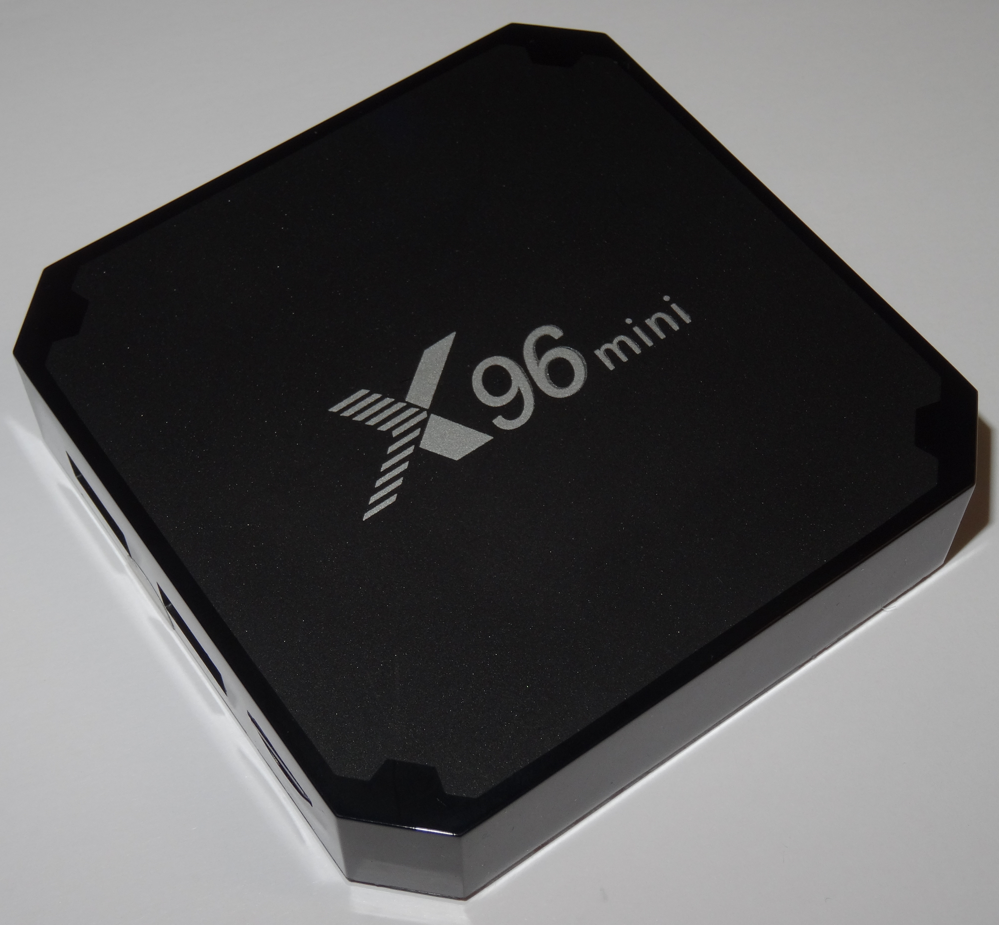
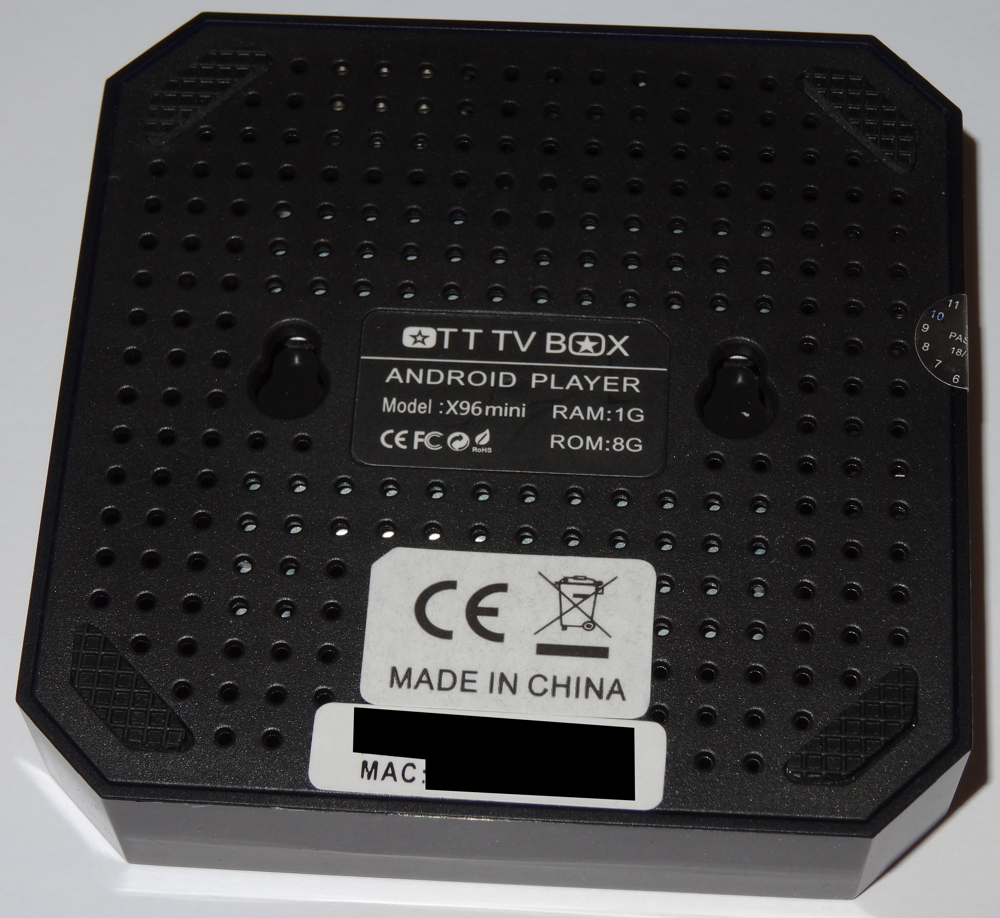
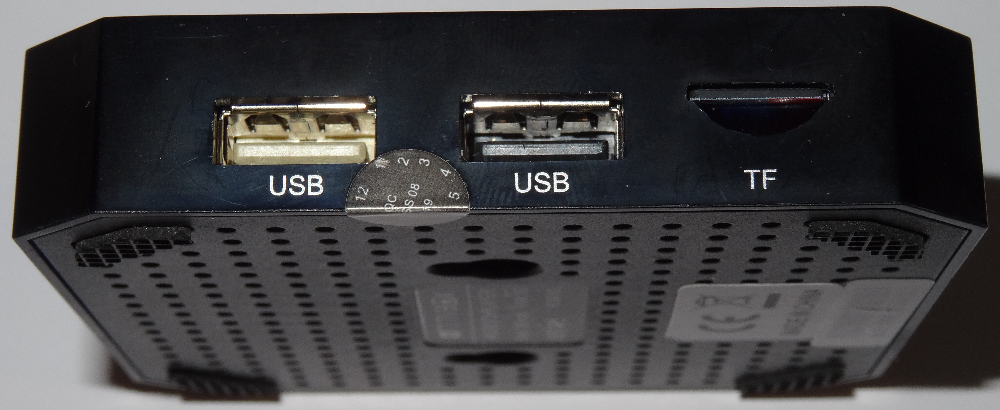
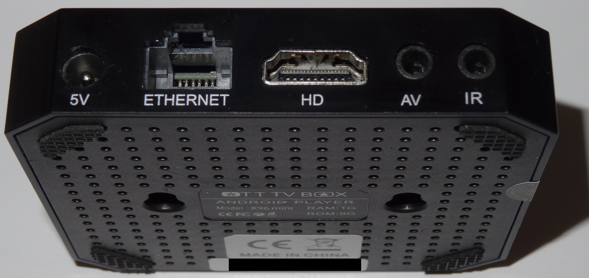

# Teardown of the X96 Mini

The X96 Mini can run into thermal issues when playing back files for a longer period. In order to fix the problem, one has to fix the cooling.

While adding some fan, some pictures were taken of the exterior and interior of the device.

## Exterior

The device is square, around 82mm x 82mm, 17mm tall, with some very small rubber feet that lift the device below 1mm from the ground.

There are "ventilation holes" on the bottom surface, but those don't have any serious impact on the thermal performance. There is simply not enough clearance from the ground for airflow. Also, hot air tends to float up, not down.

Due to the rather small case, this device doesn't have too many ports, but there's everything you need.

The device can be booted from the MicroSD slot labelled `TF`. You may have to put a toothpick or something alike (non-conducting!) into the AV port, there's a microswitch hidden that you can hold during startup. It will attempt to boot from the MicroSD card. If all necessary files are available, it should boot then.
