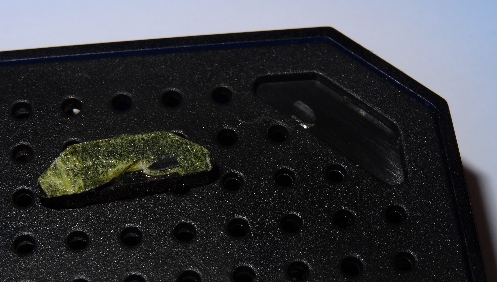
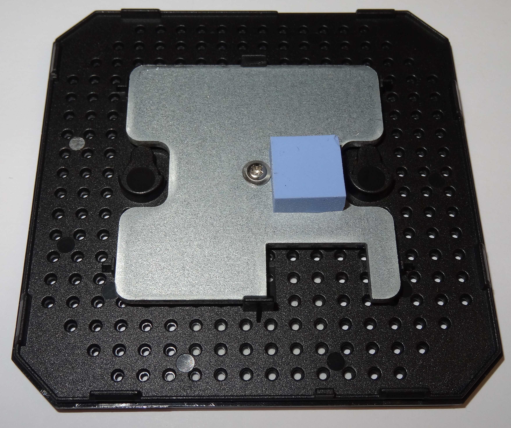

# Teardown of the X96 Mini

The X96 Mini can run into thermal issues when playing back files for a longer period. In order to fix the problem, one has to fix the cooling.

While adding some fan, some pictures were taken of the exterior and interior of the device.

## Exterior

The device is square, around 82mm x 82mm, 17mm tall, with some very small rubber feet that lift the device below 1mm from the ground.

There are "ventilation holes" on the bottom surface, but those don't have any serious impact on the thermal performance. There is simply not enough clearance from the ground for airflow. Also, hot air tends to float up, not down.

Due to the rather small case, this device doesn't have too many ports, but there's everything you need.

The device can be booted from the MicroSD slot labelled `TF`. You may have to put a toothpick or something alike (non-conducting!) into the AV port, there's a microswitch hidden that you can hold during startup. It will attempt to boot from the MicroSD card. If all necessary files are available, it should boot then.

## Getting access to the interior

There are no screws hidden below the rubber feet as you can see on the picture below. This device is just held by clips. Reasonable, given the small size.

Just insert a pocket knife, some plastic card or, if you have to, a flat head screwdriver on one side and move the top cover to the side. The clips are mounted on the top cover, they clip into notches on the bottom cover. Repeat on all four sides. You probably have to cut the "QC" sticker.

## Interior

There is some big aluminium heatsink mounted to the bottom cover, with some blue rubber(?) cuboid mounted to it that is slightly sticky (so don't touch it with your finger). The rubber thing covers the SoC, so it most likely shall transport the heat to the heatsink.

The board is mounted with screws, and doesn't look bad at all, especially given the low price. There was no need to remove the board, so there are no pictures of the other side (yet).

## Fixing the thermal issues

Given the layout of the heatsink and SoC, those holes have most likely no significant effect on the thermal performance. It will help much more to just flip the device and use it upside down, with the bottom on top. Then, heat is dissipated into the air above the device, as it should normally.

It might help to add some fan on top of the existing rear cover. It should blow upwards to transport the hot air dissipated by the heat sink into the room.

A better solution would be to replace the entire passive cooling. To do so, one could add a regular aluminium heat sink (similar to the ones you can put on your Raspberry Pi), remove the heat sink, cut a hole in the bottom cover and mount a fan instead (blowing away from the case). To increase the airflow, a hole needs to be cut in one of the sides of the top cover without any ports. You should remove the PCB in advance.

## See also

- https://forum.armbian.com/topic/9649-proper-cooling-system-of-tv-boxes/
